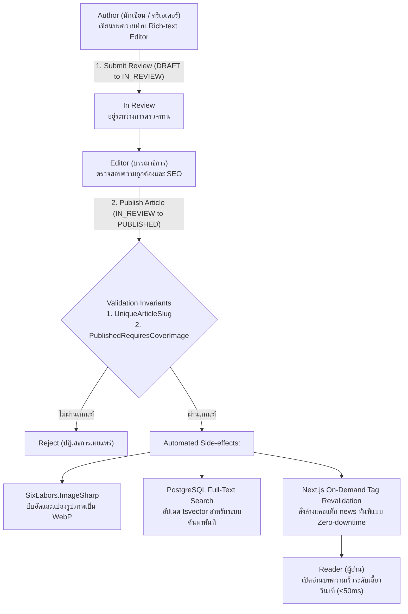

# 06_CMS_ENGINE: High-Performance Headless CMS & Publishing Engine

ระบบจัดการเนื้อหา (Headless Content Management System) ที่ออกแบบมาเพื่อรองรับ Traffic ระดับล้านเพจวิวต่อวัน ด้วยสถาปัตยกรรม Next.js 16 Partial Prerendering (PPR) ผสานพลังกับ .NET 10 HybridCache และระบบแปลงรูปภาพ WebP อัตโนมัติ

---

## 🔄 ภาพรวม Workflow การทำงาน (Business & Technical Workflow)

### รายละเอียดขั้นตอนการเปลี่ยนสถานะ (State Transitions):
1. **`DRAFT ➔ IN_REVIEW` (Trigger: `SUBMIT_REVIEW`)**: นักเขียนเขียนบทความผ่าน Tiptap WYSIWYG Editor และส่งเข้าสู่กระบวนการตรวจทาน
2. **`IN_REVIEW ➔ PUBLISHED` (Trigger: `PUBLISH`)**: บรรณาธิการตรวจสอบและกดเผยแพร่ ระบบจะรันกระบวนการเบื้องหลังแบบอัตโนมัติ:
   - แปลงภาพปกและภาพประกอบเป็นฟอร์แมต WebP ขนาดกะทัดรัด
   - อัปเดต Full-Text Search Index ในฐานข้อมูล
   - ยิง Tag Revalidation ไปยัง Next.js Edge เพื่อให้ผู้อ่านทั่วโลกเห็นเนื้อหาใหม่ทันทีโดยไม่ต้อง Build เว็บใหม่

---

## 🛡️ กฎเหล็กของระบบ (Domain Invariants)

1. **`UniqueArticleSlug` (URL Slug ต้องไม่ซ้ำกันเด็ดขาด)**:
   - ป้องกันปัญหา URL ชนกัน ซึ่งส่งผลเสียต่อการจัดอันดับ SEO และการเข้าถึงบทความ
2. **`PublishedRequiresCoverImage` (บทความที่เผยแพร่ต้องมีภาพหน้าปกเสมอ)**:
   - ป้องกันบทความที่ไม่มีภาพประกอบหลุดออกสู่หน้าหลัก ซึ่งจะทำให้ Layout ของเว็บและการแชร์ไปยัง Social Media (OpenGraph) เสียหาย

---

## 💻 Tech Stack & เหตุผลในการเลือกใช้

| ส่วนประกอบ | เทคโนโลยีที่เลือก | เหตุผลที่เลือก | ข้อดีหลัก (Advantages) |
|---|---|---|---|
| **Frontend UI** | **Next.js 16 (PPR & ISR)** | รองรับ Partial Prerendering และ On-Demand Incremental Static Regeneration | เนื้อหาโหลดได้เร็วระดับ Static Page แต่ยังสามารถอัปเดตแบบ Dynamic ได้ทันที |
| **Rich-Text Editor** | **@tiptap/react** | Headless WYSIWYG Editor ไร้ข้อจำกัดเรื่อง Styling | จัดการเนื้อหาแบบบล็อก (Headings, Code, Tables, Images) ได้อย่างยืดหยุ่น |
| **SEO Optimizer** | **next-seo** | จัดการ Meta Tags, OpenGraph, และ JSON-LD Structured Data อัตโนมัติ | เพิ่มคะแนน Core Web Vitals และการติดอันดับบน Google Search |
| **Backend API** | **.NET 10 (C#)** | ประสิทธิภาพการประมวลผลสูง รองรับ HybridCache ตัวใหม่ล่าสุด | แคชเนื้อหาแบบ Multi-tier (L1 Memory + L2 Distributed) ได้อย่างรวดเร็ว |
| **Image Processing** | **SixLabors.ImageSharp** | ไลบรารีจัดการรูปภาพ Native C# ประสิทธิภาพสูง ไม่พึ่งพา C++ Library ภายนอก | ย่อขนาดรูปและแปลงเป็น WebP ได้รวดเร็ว ประหยัด Bandwidth ของ CDN ได้กว่า 70% |
| **Search Engine** | **EF Core 10 + Npgsql FTS** | ใช้ PostgreSQL Full-Text Search (tsvector / tsquery) | ค้นหาบทความภาษาไทยและอังกฤษได้อย่างแม่นยำโดยไม่ต้องติดตั้ง Elasticsearch แยก |

---

## 🚀 สรุปสถาปัตยกรรม (Architecture Highlights)

- **Static at the Edge, Dynamic at the Core**: ให้ความเร็วในการเปิดหน้าเว็บเทียบเท่า Static HTML แต่สามารถแก้ไขและเผยแพร่เนื้อหาใหม่ได้ทันทีผ่านระบบ On-Demand Revalidation
